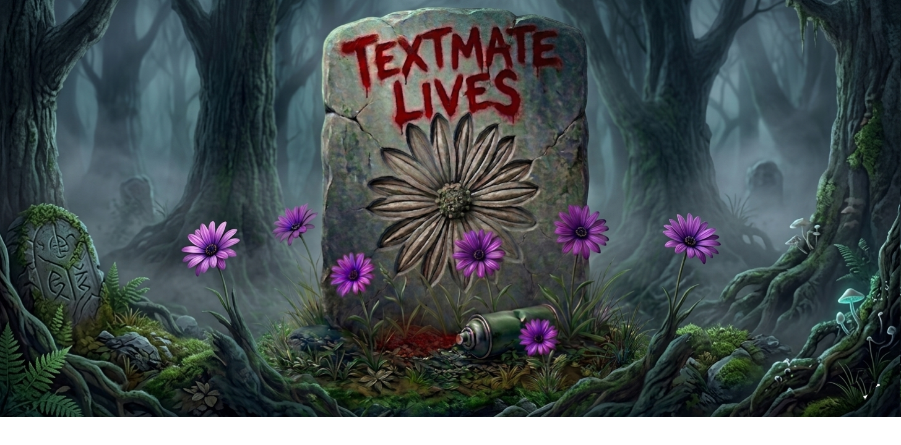

# TextMate

<p align="center">
  
</p>

## About this fork

I ❤️ TextMate.

I have been using it almost everyday since I bought it (way back in I think 2008?) and while many friends and colleagues moved on to Sublime, then Atom then VS Code etc. I stayed with TextMate. I just like TextMate. Even with its many quirks over the last few years, I stuck with it -- it is a trusted ally. I still think when it comes to editing, it has features that many folks fail to appreciate.

I have always wanted to contribute and help get it back up to speed, but to be honest, I am not much of a macOS programmer and TextMate is a fairly sophisticated app. You can probably see where this is heading: *vibe coded fixes.*

Now, I recognize that some folks may not be keen on this practice and so I make no assumptions or prognostications and I will not storm Allan Odgaard with unsolicited PRs, but I have a bunch of changes that I think could help put TM back in a great place for the other folks out there that still enjoy using it.

@sorbits if you are still out there, thank you for TextMate. I hope that this message finds you well and that you do not find the work distasteful or offensive.

Long live TextMate!

## Requirements

- Apple Silicon (arm64); Intel Macs are not supported.
- macOS 26 or later.
- System Ruby 2.6.10 (`/usr/bin/ruby`) for bundle commands. Override with `TM_RUBY` if needed.

## Download

Grab the latest signed and notarized build from the [Releases page](https://github.com/textmatelives/textmate/releases).

## Feedback

For fork-specific bugs, feature requests, and discussion, [file an issue](https://github.com/textmatelives/textmate/issues). Patches are welcome too — [open a pull request](https://github.com/textmatelives/textmate/pulls), with or without a matching issue.

For questions about TextMate proper (history, design, upstream behaviour), see the [upstream project](https://github.com/textmate/textmate).

## Screenshot

<p align="center">
  
</p>

# Building

## Setup

To build TextMate, you need the following:

 * [Xcode][]         — 26 or later; provides `xcodebuild` and opens `TextMate.xcodeproj`
 * [boost][]         — portable C++ source libraries
 * [multimarkdown][] — marked-up plain text compiler
 * [sparsehash][]    — a cache friendly `hash_map`

The non-Xcode dependencies are installed via [Homebrew][]:

```sh
brew install boost google-sparsehash multimarkdown
```

(`Xcode/Base.xcconfig`'s header search path is Homebrew-specific — a MacPorts prefix is not
currently wired in.)

After installing dependencies, make sure you have a full checkout (including submodules), then build from the command line:

```sh
git clone --recursive https://github.com/textmatelives/textmate.git
cd textmate
xcodebuild -project TextMate.xcodeproj -scheme TextMate -configuration Release build
```

or open `TextMate.xcodeproj` in Xcode and press ⌘B. `bin/build` wraps the same `xcodebuild`
invocation and additionally works around two environment issues that can break Xcode's
Ruby-based script phases (a leaked Ruby version manager, a root-owned credits cache) — see
`CLAUDE.md` for details.

`TextMate.xcodeproj` is committed, generated from the checked-in `project.yml` by [XcodeGen][].
XcodeGen itself is needed only to regenerate the project after editing `project.yml`, not to build.

## Building from within TextMate

Self-hosted building (pressing ⌘B inside a running TextMate.app to rebuild TextMate itself)
previously worked via the optional [Ninja bundle](https://github.com/textmate/ninja.tmbundle)
and `.tm_properties`' `TM_NINJA_TARGET`. Neither ninja nor that mapping exist anymore — build
from Xcode or the command line instead (see above).

## Build Targets

```sh
xcodebuild -project TextMate.xcodeproj -scheme TextMate -configuration Release build
```

or equivalently `bin/build`. To clean, use Xcode's own Product → Clean Build Folder, or delete
`~/build/textmate-revived/xcode`.

# Legal

The source for TextMate is released under the GNU General Public License as published by the Free Software Foundation, either version 3 of the License, or (at your option) any later version.

TextMate is a trademark of Allan Odgaard.

[boost]:         http://www.boost.org/
[multimarkdown]: http://fletcherpenney.net/multimarkdown/
[Homebrew]:      http://brew.sh/
[sparsehash]:    https://code.google.com/p/sparsehash/
[Xcode]:         https://developer.apple.com/xcode/
[XcodeGen]:      https://github.com/yonaskolb/XcodeGen
