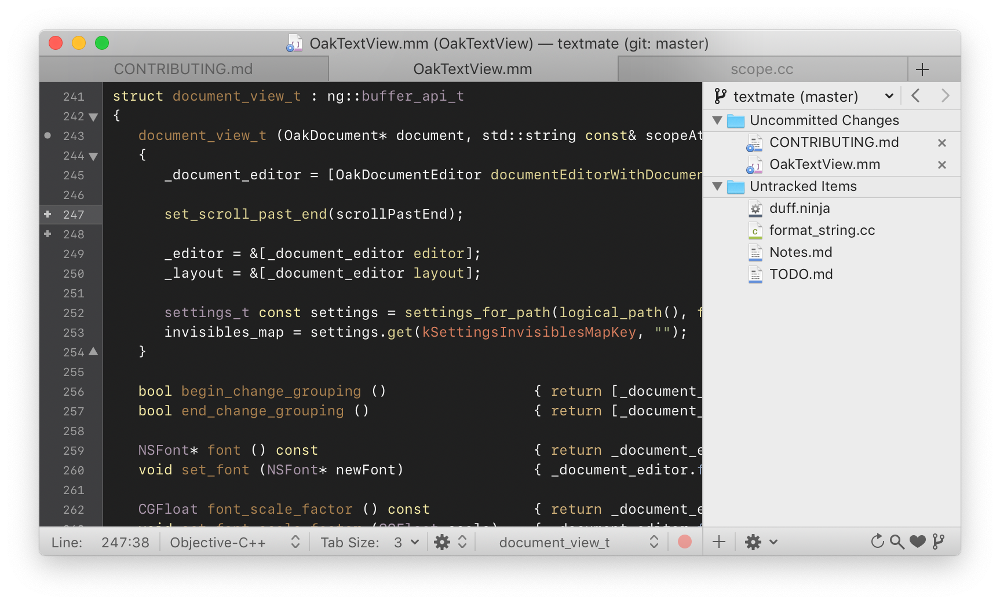

# TextMate Revived

> This is an **unaffiliated, community-maintained fork** of [TextMate](https://github.com/textmate/textmate)
> by MacroMates ApS / Allan Odgaard. It is not endorsed by, sponsored by, or otherwise affiliated
> with MacroMates or Allan Odgaard. Licensed under the GNU General Public License v3.0 (or later),
> the same license as upstream.

## About this fork

TextMate, brought forward to macOS 26 on Apple silicon.

Upstream's last release predates Apple silicon Macs and today's macOS. This fork exists to keep the
editor building, signed, notarized and installable on current hardware, without changing what
TextMate is. The visible differences are meant to be the absence of problems: it launches on a
modern Mac, it updates itself, and it installs with `brew`.

What that has meant in practice: replacing the retired `rave`/`ninja` build with a committed Xcode
project, removing dependencies the editor no longer needed, moving off Ruby 1.8-era assumptions to
the system Ruby 2.6.10, migrating the HTML output from `WebView` to `WKWebView`, replacing the Quick
Look generator macOS had stopped loading with a modern extension, and taking on the fork's own
identity for bundle identifiers and the privileged helper so it can coexist with an official
install.

Long live TextMate.

## Requirements

- Apple Silicon (arm64). Intel Macs are not supported.
- macOS 26 or later.
- System Ruby 2.6.10 (`/usr/bin/ruby`) for bundle commands. Override with `TM_RUBY` if needed.

## Install

```sh
brew tap sdenike/tap
brew install --cask textmate-revived
```

That tap serves every application from this account, so you only need to tap it once.

Or download the signed, notarized build directly from the
[Releases page](https://github.com/sdenike/textmate/releases). The app updates itself from there —
Check for Updates installs an update only if it carries the same Developer ID as the copy you are
running.

## Feedback

For fork-specific bugs, feature requests, and discussion,
[file an issue](https://github.com/sdenike/textmate/issues). Patches are welcome —
[open a pull request](https://github.com/sdenike/textmate/pulls), with or without a matching issue.

For questions about TextMate proper (history, design, upstream behaviour), see the
[upstream project](https://github.com/textmate/textmate).

## Screenshot

<p align="center">
  
</p>

# Building

## Setup

You need:

 * [Xcode][]         — 26 or later; provides `xcodebuild` and opens `TextMate.xcodeproj`
 * [multimarkdown][] — renders the About, Legal and CHANGELOG pages during the build

```sh
brew install multimarkdown
```

That is the whole list. Earlier versions of this file also asked for `boost` and
`google-sparsehash`; both were removed in v3.0.0-revived.6 and nothing in the tree includes them.

Optionally, `brew install mercurial subversion` — the `scm` test suite skips its Mercurial and
Subversion cases without them, so 2 of its 84 tests fail on a machine that has neither. Nothing
else needs them.

`Xcode/Base.xcconfig`'s header search path is Homebrew-specific; a MacPorts prefix is not currently
wired in.

Then:

```sh
git clone --recursive https://github.com/sdenike/textmate.git
cd textmate
bin/build
```

**Prefer `bin/build` over a bare `xcodebuild`.** It wraps the same invocation and works around two
environment problems that break Xcode's Ruby script phases with errors pointing at the wrong
culprit — a leaked Ruby version manager, and a root-owned credits cache. See `CLAUDE.md`.

Opening `TextMate.xcodeproj` in Xcode and pressing ⌘B works too.

`TextMate.xcodeproj` is committed, generated from the checked-in `project.yml` by [XcodeGen][].
XcodeGen is needed only to regenerate the project after editing `project.yml`, not to build.

## Tests

```sh
bin/build <framework>/test      # e.g. bin/build scm/test
```

Four targets fail or crash for known environmental reasons on a developer machine, documented in
`docs/benchmarks/2026-08-12-ninja-parity.md`. That document is the baseline any change should be
compared against.

## Building from within TextMate

Self-hosted building (pressing ⌘B inside a running TextMate.app to rebuild TextMate itself)
previously worked via the optional [Ninja bundle](https://github.com/textmate/ninja.tmbundle) and
`.tm_properties`' `TM_NINJA_TARGET`. Neither ninja nor that mapping exist anymore — build from Xcode
or the command line instead.

## Cleaning

Use Xcode's Product → Clean Build Folder, or delete `~/build/textmate-revived/xcode`. Build output
deliberately lives outside the working copy so Spotlight does not index a second launchable
`TextMate.app`.

# Legal

The source for TextMate is released under the GNU General Public License as published by the Free
Software Foundation, either version 3 of the License, or (at your option) any later version.

TextMate is a trademark of Allan Odgaard.

[multimarkdown]: http://fletcherpenney.net/multimarkdown/
[Xcode]:         https://developer.apple.com/xcode/
[XcodeGen]:      https://github.com/yonaskolb/XcodeGen
